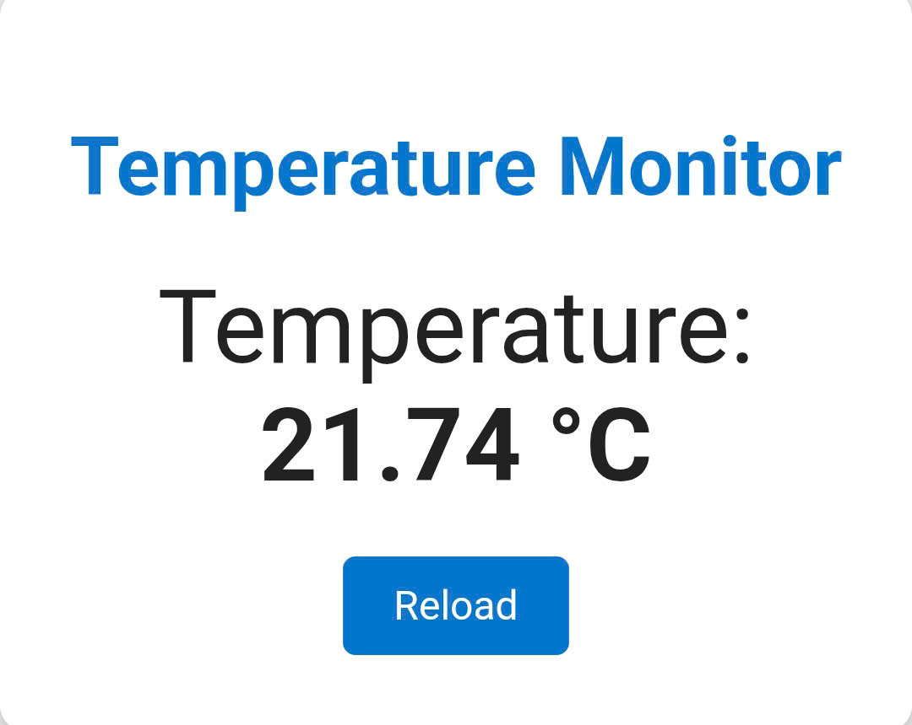

# ESP32 Thermistor Web Monitor

This project reads a thermistor value using an analog pin, calculates the temperature, and serves it on a simple web page using the ESP32's built-in WiFi capabilities.

## Hardware Required

- **ESP32 board**
- **Thermistor** (e.g., 10k NTC)
- **10k resistor** (for voltage divider)

**Wiring:**

- Connect the thermistor between the analog pin (e.g., GPIO34) and GND.
- Connect the 10k resistor between the analog pin and 3.3V.

## Wiring Diagram



## Software

- Uses the Arduino framework
- WiFi credentials are set in `src/main.cpp`
- Web server runs on port 80

## Usage

1. Upload the code to your ESP32 using PlatformIO.
2. Connect your computer or phone to the same WiFi network as the ESP32.
3. Open the ESP32's IP address in your browser to view the temperature.

---

**WiFi Credentials:**

To keep your WiFi credentials out of version control, copy the template file:

```
cp include/wifi_secrets.h.template include/wifi_secrets.h
```

Then edit `include/wifi_secrets.h` and fill in your WiFi SSID and password.

Make sure to add `include/wifi_secrets.h` to your `.gitignore` file so it is not committed.

Alternatively, you can set credentials via `platformio.ini` build flags, or edit the defaults in `src/main.cpp`.

**Note:** You can change the analog pin and thermistor parameters in the code as needed.
