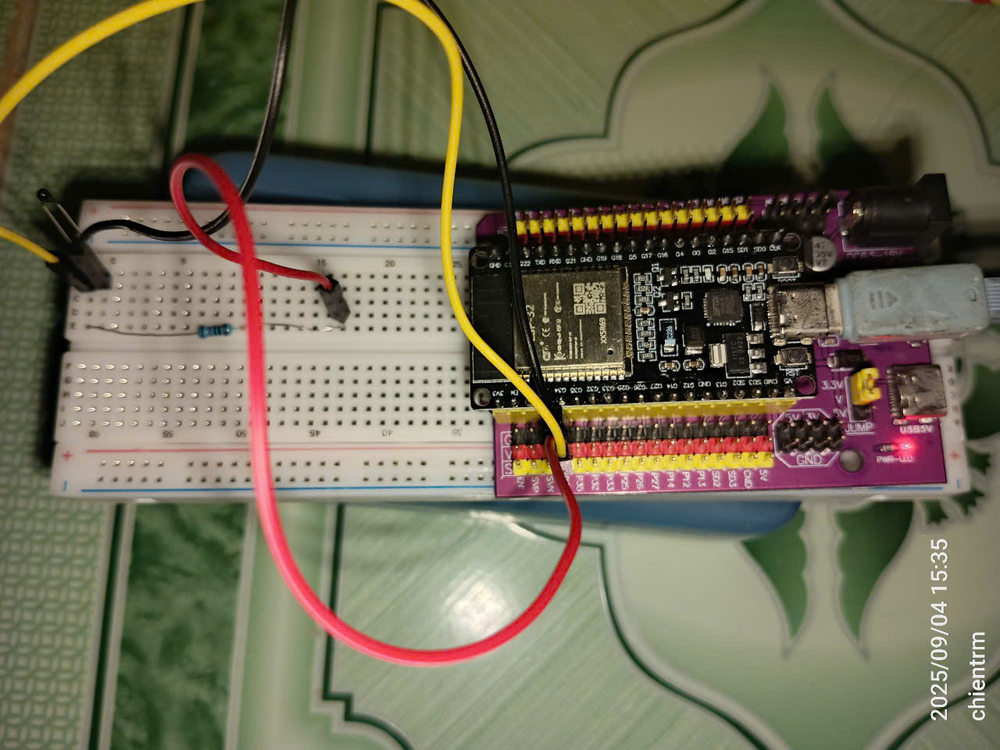

# ESP32 Thermistor & LED Web Monitor

This project uses an ESP32 to read temperature from a thermistor, display it on a web page, and show the value on a WS2812/NeoPixel LED strip. It also uses an RGB LED to indicate WiFi connection status.

## Hardware Required

- **ESP32 board**
- **Thermistor** (e.g., 10k NTC)
- **10k resistor** (for voltage divider)
- **WS2812/NeoPixel LED strip** (60 LEDs, data pin to GPIO23)
- **RGB LED** (for WiFi status, pins: GPIO25, GPIO26, GPIO27)

**Wiring:**

- Thermistor: One leg to analog pin (GPIO34), other to GND. 10k resistor between analog pin and 3.3V.
- LED strip: Data line to GPIO23 (`LED_PIN` in `src/ledstrip.h`), powered from 5V and GND.
- RGB LED: Connect red to GPIO25, green to GPIO26, blue to GPIO27 (with 220Ω resistors). Common cathode to GND.

## Wiring Diagram

### Real Wiring Photo

## Software Features

- Modular code: temperature reading, LED strip, WiFi status LED, and web server are split into separate files.
- WiFi credentials are set in `include/wifi_secrets.h`.
- Web server runs on port 80 and supports mDNS (`http://esp32thermo.local`).
- OTA updates supported (ArduinoOTA).
- RGB LED shows WiFi status: green (connected), red (not connected).

## Usage

1. Upload the code to your ESP32 using PlatformIO.
2. Connect your computer or phone to the same WiFi network as the ESP32.
3. Open the ESP32's IP address in your browser to view the temperature.

- Or, use mDNS: `http://esp32thermo.local` (see above).

4. The LED strip displays the current temperature:

- The lit LED position shows the temperature (inverted for upside-down mounting).
- Color mapping:
  - **Blue**: ≤22°C (cool)
  - **Cyan**: 22–25°C
  - **Green-Yellow**: 25–28°C
  - **Yellow**: 28–31°C
  - **Orange**: 31–34°C
  - **Red**: >34°C (hot)
- The LED updates every second for smooth indication.

5. The RGB LED shows WiFi status:

- **Green**: WiFi connected
- **Red**: WiFi not connected

---

## WiFi Credentials

To keep your WiFi credentials out of version control, copy the template file:

cp include/wifi_secrets.h.template include/wifi_secrets.h

Edit `include/wifi_secrets.h` and fill in your WiFi SSID and password.
Add `include/wifi_secrets.h` to your `.gitignore` file so it is not committed.

You can also set credentials via `platformio.ini` build flags, or edit the defaults in `src/main.cpp`.

**Note:** You can change the analog pin and thermistor parameters in the code as needed.
